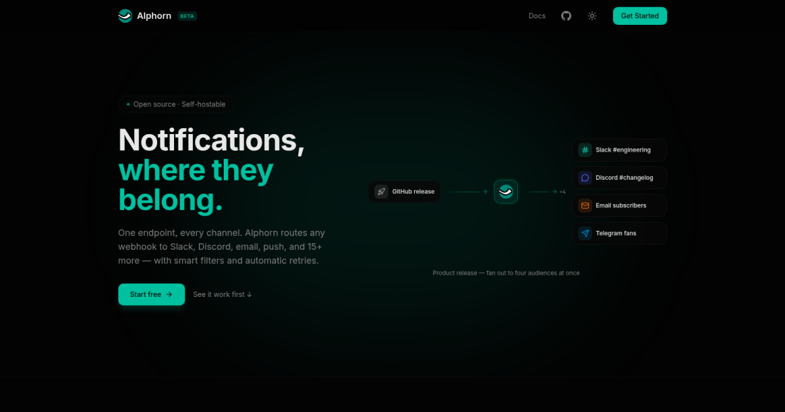

# Alphorn

**One webhook in. Every channel out.**

Point anything that emits a webhook at Alphorn and it fans the message out to Slack, Discord, Telegram, Email, PagerDuty, SMS, and 15+ other destinations — with filters, retries, real-time streams, and delivery history along the way.

## Two ways to run it

### Hosted — [app.alphorn.dev](https://app.alphorn.dev)

Sign up and start routing in under a minute. No infra, no upgrades, no 3 AM Postgres tuning. Free tier, no card.

### Self-hosted — your server, your rules

```bash
git clone https://github.com/alphorn/alphorn.git
cd alphorn && cp .env.example .env
docker compose up -d
```

Open <http://localhost:3000>. That's it. Full walkthrough in the [self-hosting guide](https://docs.alphorn.dev/self-hosting).

## What it does

- **20+ channels** — Slack, Discord, Teams, Telegram, Mattermost, Rocket.Chat, Google Chat, Zulip, Matrix, ntfy, Gotify, Pushover, PagerDuty, Opsgenie, Twilio & Vonage SMS, SMTP, SendGrid, Mailgun, generic webhooks, SSE.
- **Filter DSL** — route by priority, tags, title, body, or any JSON field in the payload.
- **Reliable delivery** — queued, retried, replayable. Nothing gets quietly dropped.
- **Real-time streams** — live SSE feed of every event flowing through your org.
- **Multi-tenant** — orgs, roles, invitations, 2FA, audit log.

<p align="center">
  
</p>

## Find us

- [alphorn.dev](https://alphorn.dev) — what & why
- [docs.alphorn.dev](https://docs.alphorn.dev) — guides, channel reference, API
- [app.alphorn.dev](https://app.alphorn.dev) — the hosted app

---

Open source under [AGPL-3.0](https://github.com/alphorn/alphorn/blob/main/LICENSE). Commercial license on request — <hello@alphorn.dev>.
